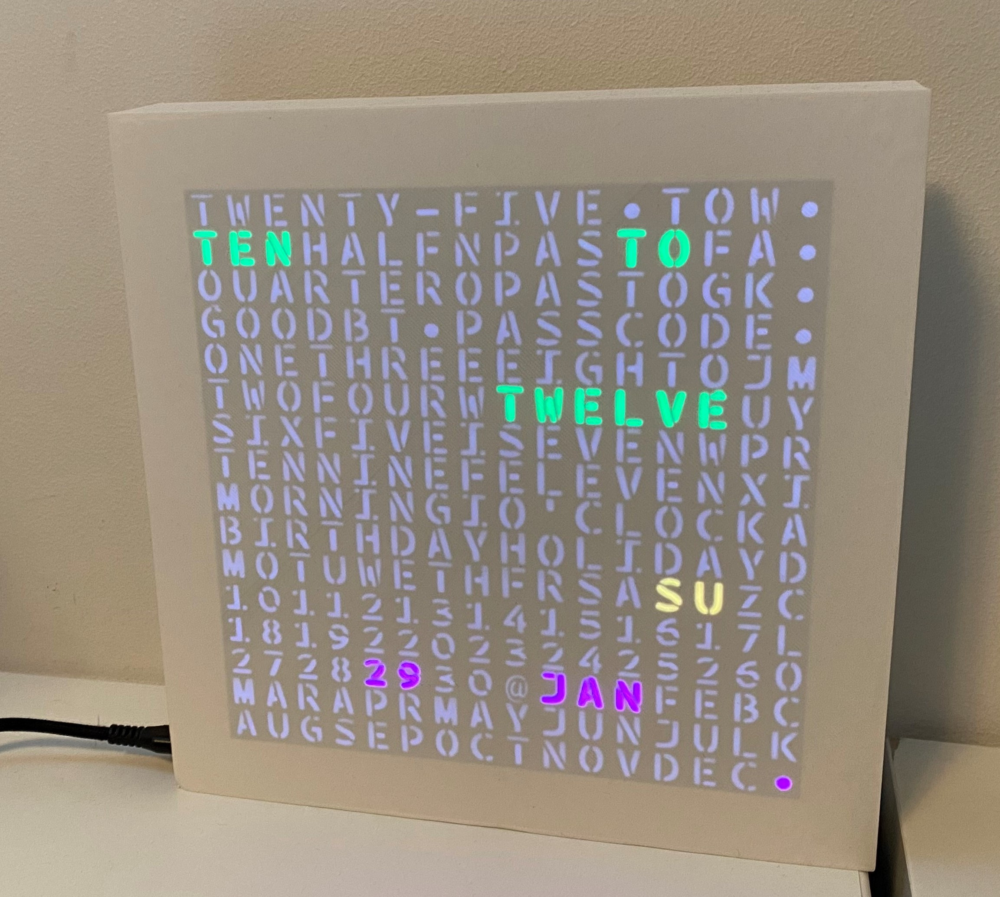

# Myriadclock
16x16 LED word clock with weekday and calender
Multilanguage and fully color customizable.

## Printing directives
### Grid
*BLACK, PLA, 11 hours, 38 minutes, +- 20 meter (61g)*

Just normal settings, `standard quality`. No need for supports, no infill. Use a brim if desired. Print with the open top of the Y stutts to the top. This way the bottom will be very smooth and there is no light leakage between base plate and the grid.

### Casing
*WHITE, PLA, 18 hours, 13 minutes, +- 44 meter (132g)*

Casing is large (20x20cm) so there might not be space to add the adhesion skirt or brim (at least on my Ender3). So please set `Build plate adhesion type` to `None`. 
To get a nice front panel, it is essential that the `bottom thickness` is at least 4 layers or else you will see the infill instead of the characters in the clock. Set the `top thickness` to 4 as well to avoid seeing the infill at the back of the clock. An infill of 20% is enough. 
Some supports are needed, for the wire hole and the PCB holder. I prefer to set `Support Structure` to `Tree` since the tree's are rather easy to remove.
The casing should be printed in white since the white is partly transparent and will make the characters of the word clock shine through.
Rather obvious, but print the casing with the open part to the top. 
Infill pattern: Cubic, 20%

### Backplane
*WHITE PLA, 9 hours, 50 minutes, +- 27 meter (80g)*

Rotate the backplane UPSIDE-DOWN (flat part down)!
My initial version was printed with only 2 top and 2 bottom layers but that way you can see the infill, so it would be better to just use the default `standard quality`. 
No supports needed, build skirt can be printed.

### Clamp(s)
*3x PLA (Color does not matter), 51 minutes, +- 2 meter (6g)*

Rotate the clamp to it's side top print without supports!
This is used to hold the LED panel on top of the grid, you will probably need 3 clamps. 
Normal print settings, `standard quality` is fine.

### Character plate
*BLACK PLA, 6 hours 34 minutes, +- 8 meter (26g)*

For best result: Print the plate UPSIDE-DOWN. That way the smooth part will be touching the casing.
Print this in black. The plate is only 5 layers tick, all layers should be printed. You might want to tweak some setting to prevent holes getting accidentally be filled with debris/hairs/wires (allthough I didn't find the correct setting for that yet...)
Travel-Combining mode: All
Retract at layer change: True
Z Hop Height: 0.4
Avoid printed parts when travelling: False (I rather not travel over the holes!)

PLA: 105m (for me that is approx €6)

## Components

### LED Panel

WS2812B LED Panel 16x16
Matrix SK6812 WS2812B Panel Flexible 5050 RGB 8x8 8x32 16x16 Pixels Digital Sreen Display Light GyverLamp SP107E LC1000A Kit
https://www.aliexpress.com/item/32875701384.html?spm=a2g0s.9042311.0.0.27424c4dam1nq0
*Buy the WS2812B 16x16 only*

Approx €10 (depends on supplier and shipping fees)

### ESP32 Module
4 MB Flash For WeMos D1 ESP32 ESP-32 ESP-32S ESP32S Wifi Bluetooth Wireless Module Based ESP-WROOM-32 Dual Core Mode CP
https://www.aliexpress.com/item/32917886231.html?spm=a2g0s.9042311.0.0.11af4c4drBH1TU

Approx €4 (depends on supplier and shipping fees)

Total costs (without electricity): +- €20  
